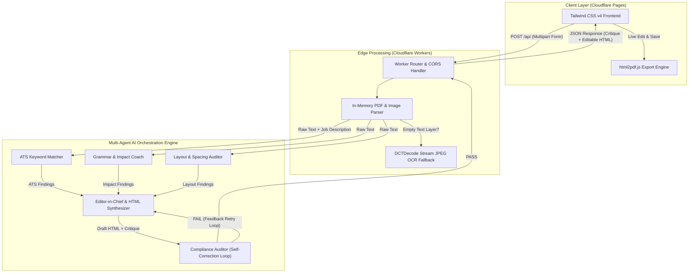

# Résumé Optimizer

> An edge-native, multi-agent AI system built on **Cloudflare Workers** and **Cloudflare Pages** that processes PDF/image résumés entirely in-memory, provides deep software engineering critiques, and autonomously rewrites résumés into print-ready, dynamic HTML formats.

---

## Executive Overview

**Résumé Optimizer** is a privacy-first, systems-focused career tool designed to help software engineers, systems developers, and tech professionals optimize their résumés for Applicant Tracking Systems (ATS) and hiring managers. 

Unlike traditional platforms that upload user files to persistent third-party database buckets, **Résumé Optimizer** operates **ephemerally in-memory at the edge** via Cloudflare Workers. It uses a **Multi-Agent AI Pipeline** to evaluate résumés across multiple axes simultaneously—ATS keyword density, action-verb impact metrics, brand consistency, and vertical whitespace budget—before generating a fully editable, polished HTML rewrite.

---

## Key Technical & Architectural Features

- **Ephemeral & Zero Persistent Storage:** Processes uploaded PDF and image binaries strictly in-memory (`ArrayBuffer` / `Uint8Array`). Raw résumé files are never written to disk or database storage.
- **Autonomous Multi-Agent Pipeline:**
  - **Parallel Specialized Critics:** Evaluates résumé input across 3 specialized dimensions concurrently:
    1. **ATS & Keyword Matcher Agent:** Compares candidate experience against target job descriptions, identifying key skill gaps and keyword alignment.
    2. **Grammar, Tone, & Impact Coach Agent:** Audits bullet points for active verbs, quantified engineering metrics (revenue, throughput, latency improvements), and career growth trajectory.
    3. **Layout & Spacing Auditor Agent:** Computes layout density and recommends vertical whitespace adjustments based on a strict page budget.
  - **Editor-in-Chief & Synthesis Agent:** Consolidates critique reports into an *Executive Resume Critique* and generates a self-contained, responsive HTML rewrite.
  - **Compliance Auditor & Linter Agent (Self-Correction Loop):** Validates generated HTML against strict compliance criteria (bullet point tags `<ul>`/`<li>`, pure black text styling `#000000` with blue links `#004b93`, relative font scaling in `em`, zero hallucination rules). If validation fails, the loop automatically retries up to 3 times with feedback.
- **Scanned PDF OCR Fallback:** Incorporates a pure JavaScript stream parser to extract raw `/DCTDecode` JPEG bytes from scanned PDFs, passing them through Cloudflare Workers AI for OCR fallback when native text extraction yields empty layers.
- **Interactive In-Browser Resume Editor:** Generates HTML output with `contenteditable="true"` enabled, allowing users to fine-tune text live in their browser before exporting to PDF.
- **Bot Protection:** Integrated with Cloudflare Turnstile on the frontend to block automated bots.

---

## System Architecture & Workflow



---

## Technology Stack

| Layer | Technologies & Tools |
| :--- | :--- |
| **Runtime & Compute** | Cloudflare Workers (V8 Isolates), TypeScript |
| **AI & LLM Services** | Cloudflare Workers AI, AGY Remote Execution Bridge |
| **Frontend UI** | Cloudflare Pages, HTML5, Tailwind CSS v4, `marked.js` |
| **PDF Rendering & Processing** | `unpdf` (PDF.js for Edge), `html2pdf.js` |
| **Security & Utilities** | Cloudflare Turnstile, Cloudflare Access Service Tokens |
| **Deployment / CI/CD** | GitHub Actions (`wrangler-action@v3`), Wrangler CLI |

---

## API Reference

### 1. Evaluate Résumé

**`POST /api/`** or **`POST /`**

Processes a PDF or image résumé and returns an executive critique alongside an optimized, editable HTML rewrite.

#### Request Headers
```http
Content-Type: multipart/form-data
```

#### Form-Data Parameters
| Field | Type | Required | Description |
| :--- | :--- | :--- | :--- |
| `resume` (or `file`) | `File` (PDF/PNG/JPEG) | **Yes** | The binary résumé file to evaluate. |
| `jobDescription` | `string` | No | Optional job description text (max 10,000 chars) for ATS keyword matching. |

#### Example Request (cURL)
```bash
curl -X POST \
  -F "resume=@/path/to/resume.pdf" \
  -F "jobDescription=Looking for a Senior Systems Engineer proficient in Rust, C++, and Distributed Systems." \
  https://critique.superjeffc.com/api/
```

#### Example JSON Response
```json
{
  "critique": "# Executive Resume Critique & Synthesis Report\n\n### ATS Alignment & Keyword Match\n...\n\n=== REWRITTEN RESUME ===\n<div contenteditable=\"true\" style=\"...\">...</div>",
  "extractedTextLength": 2840,
  "targetPageCount": 1
}
```

---

## Local Development & Setup

### Prerequisites
- [Node.js](https://nodejs.org/) (v20 or higher)
- [npm](https://www.npmjs.com/)
- [Wrangler CLI](https://developers.cloudflare.com/workers/wrangler/install-and-update/) (`npm install -g wrangler`)

### 1. Clone & Install Dependencies
```bash
git clone https://github.com/superjeffc/resume-optimizer.git
cd resume-optimizer
npm install
```

### 2. Generate TypeScript Bindings
```bash
npx wrangler types
```

### 3. Local Environment Variables
Create a `.dev.vars` file in the project root for local development secrets:
```env
API_SECRET=your_local_secret_here
CF_CLIENT_ID=your_cf_client_id
CF_CLIENT_SECRET=your_cf_client_secret
```

### 4. Run Development Server
Launch Cloudflare Wrangler's local development server:
```bash
npm run dev
```
The API server will start locally at `http://localhost:8787/`.

### 5. Run End-to-End Test Suite
In a separate terminal window, execute the automated end-to-end integration test:
```bash
node test_worker.js
```

---

## CI/CD & Production Deployment

Deployments to production are fully automated via GitHub Actions on every push to the `main` or `master` branches (defined in `.github/workflows/deploy.yml`).

### Manual Deployment via Wrangler CLI
```bash
npm run deploy
```

---

## Security & Privacy Commitments

- **Zero Data Retention:** No uploaded PDF or image file contents are written to disk, database storage, or external logs.
- **Sandboxed Execution:** All document parsing occurs within ephemeral V8 isolates.
- **Strict Injection Protection:** Prompt templates sanitize untrusted text tags to prevent prompt injection or execution of embedded commands.

---

## Copyright & License

**Copyright © 2026 Jeff Chan. All Rights Reserved.**

This repository and its source code are proprietary and protected under international copyright law. Unauthorized copying, distribution, modification, public display, or reuse of any portion of this codebase—in source or compiled form—without explicit written permission from the copyright holder is strictly prohibited.

---

<p align="center">
  Developed by <b>Jeff Chan</b> • <a href="https://github.com/superjeffc">@superjeffc</a>
</p>
